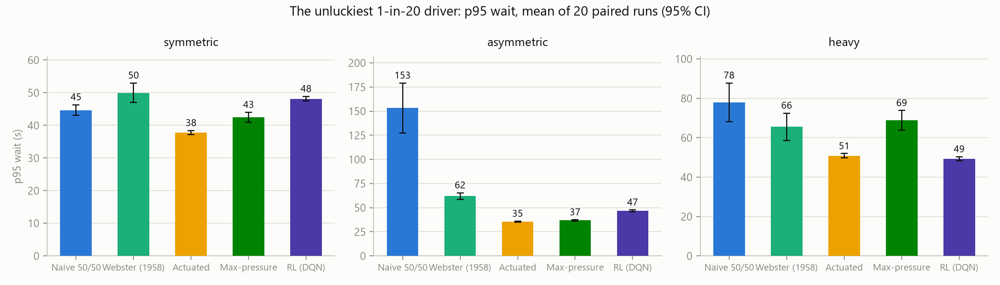
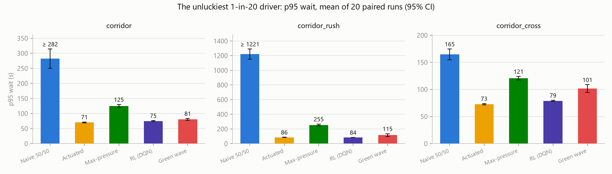

# traffic-rl

**Can smarter traffic-light timing cut how long we all wait?**

We have all sat at a red light on an empty road while the busy direction backs
up. This project tests whether better signal control actually fixes that — an
honest simulator, the classic strategies traffic engineers already use as real
opponents, and a retiming tool that turns the count data cities already
collect into implementable timing sheets.

**The current verdict, up front.** Phase 5 made the model realistic — turning
movements, protected/permissive lefts, multi-lane approaches, ITE/MUTCD
clearance intervals from site geometry — and realism redrew the scoreboard
honestly:

- **At single intersections, the 1960s actuated controller took its crown
  back.** It wins all five scenarios; the learned policy sits 1–3 s behind on
  four of them and loses badly at the protected-left arterial (details below,
  published rather than buried).
- **At corridor scale, the learned policy keeps a real win**: it beats
  actuated on the rush-hour corridor by 10.0 s journey p95 (paired 95% CI
  [+4.6, +15.5]) and beats the coordinated green wave everywhere.
- **The most valuable Phase 5 find was a safety bug**: with more than two
  phases, the old anti-starvation backstop could be sidestepped by a
  controller that never requested the left-turn phase. The state machine now
  guarantees any waiting call is served within `max_call_wait` (200 s), no
  matter how adversarial the controller — safety by construction, extended.

**This is also a practical tool**: point `traffic-rl-optimize` at a CSV of
real intersection counts — including standard turning-movement counts — and
it returns a screening-level retiming study: left-turn protection warrants,
phase plans, geometry-derived clearance intervals, time-of-day green splits,
and CI-backed projections of the wait-time reduction.

## Optimize a real intersection from count data

Feed the tool a standard count study. Legacy per-approach totals still work;
full turning-movement counts (TMC) unlock the Phase 5 realism:

```csv
time,north_left,north_thru,north_right,south_left,...,west_right,ped_ns,ped_ew
07:00,215,610,60,95,340,45,...,25,18,14
```

```powershell
traffic-rl-optimize counts.csv --site site.json
# benchmark against your intersection's current plan:
traffic-rl-optimize counts.csv --site site.json --current-greens 15 30 28
```

`site.json` carries the geometry the ITE/MUTCD formulas need (approach speeds,
street widths, lanes, left-turn bays); without it, conservative defaults are
used and the report says so. The study you get back:

- **Left-turn protection warrant** per approach — volume (≥ 240 veh/h) and
  opposing cross-product (≥ 50k/100k) screening, with the triggering interval
  and numbers cited in the report.
- **Phase plan** in canonical order (protected lefts leading), with
  **clearance intervals from geometry**: ITE kinematic yellow from approach
  speed, all-red from crossing width, MUTCD pedestrian walk + flashing
  don't-walk from crosswalk length.
- **Time-of-day plans**: per-interval Webster + paired-seed local search, then
  a **full-profile tournament** — interval-by-interval optimization alone
  misses peak-hour queue carryover (measured on the bundled arterial, where
  it recommended plans that lost to equal splits until the tournament stage
  caught it).
- **CI-backed comparison** against naive, Webster-on-average-flows, actuated,
  max-pressure, and the learned policy — because "what would detection
  hardware buy instead?" is the question a screening study should answer.

**The study starts where the street starts.** The baseline is the
intersection's *current* timings: pass `--current-greens` to use the installed
plan, or the tool derives a practice-typical plan from your data (cycle from
the FHWA Signal Timing Manual's 60–120 s practice range, splits proportional
to peak counts). That baseline's wait times are measured first — with an HCM
LOS grade — and every projection is improvement over it; the current plan also
seeds the search and enters the final tournament, so the recommendation can
never lose to what is already installed (when it can't win, the report says
"no retiming warranted" — the honest screening outcome).

On the bundled legacy example (`examples/counts_example.csv`, a 5-hour AM
profile) the practice baseline sits at p95 44.2 s (mean 16.5 s, LOS B); the
recommended plans reach 42.3 s, a naive 50/50 signal 101.5 s, actuated 34.1 s
and the learned policy 36.5 s — on a demand profile neither ever saw.

**Sample lights**: `examples/sites/` bundles two ready-to-run intersections
with full TMC profiles and geometry — a 45 mph suburban arterial whose NS
lefts trip the protection warrant (4.3 s yellows, 3-phase plan), and a 25 mph
downtown corner with shared-lane lefts and lunch-peak pedestrians. Both are
representative sites, not surveys; see `examples/sites/README.md`.

**Whole corridors too:** add a `node` column and the same command retimes the
arterial — coordinated time-of-day plans with a common cycle, per-node
Webster splits, and progression offsets chosen by simulation. On the bundled
3-intersection example it picks the westbound wave for the AM rush and cuts
journey p95 from an unstable **≥ 764 s** under uncoordinated naive timing to
**72 s** (actuated 61 s, shared RL 66 s alongside). The corridor model stays
through-only — a stated limit.

## Phase 5 results: the realistic model

Headline metric: **p95 wait** — the unluckiest 1 in 20 drivers. Every number
is the mean of **20 paired-seed runs** with a t-based 95% CI; every controller
sees the same 20 demand realizations.

| p95 wait (s) | symmetric | asymmetric | heavy | arterial_lefts | downtown_shared |
|---|---|---|---|---|---|
| Naive equal-split | 45.8 | **≥ 162.4** | 80.5 | 68.0 | 39.9 |
| Webster (1958) | 50.3 | 62.0 | 68.3 | ≥ 137.1 (unstable) | 51.5 |
| **Actuated** | **37.6** | **36.0** | **51.0** | **54.1** | **34.5** |
| Max-pressure | 43.9 | 37.1 | 69.0 | 94.3 | 36.9 |
| RL (DQN) | 40.4 | 37.3 | 53.9 | 202.8 | 37.5 |

`arterial_lefts` is the new flagship: a 45 mph 2-lane arterial with warranted
protected lefts and geometry-derived timings. `downtown_shared` is a narrow
downtown corner where lefts share the lane and pedestrians dominate. Paired
differences (actuated − RL): −2.8 [−3.6, −2.1] symmetric, −1.3 [−2.4, −0.2]
asymmetric, −2.9 [−4.1, −1.7] heavy, −3.0 [−3.9, −2.1] downtown — actuated's
wins are small but statistically real. On the arterial it is −149 s: not
close, and the honest headline of this phase.



Two findings worth the price of admission:

1. **Webster goes unstable at the protected-left arterial** — a fixed plan
   built from average flows cannot buy the left phase enough green at the
   peak without starving it off-peak. This is why real arterials get
   detection hardware, and the model now reproduces it.
2. **The learned policy's arterial failure is a credit-assignment story, not
   a mystery.** The policy defers the left phase (immediate clearance cost,
   slowly-accruing starvation penalty) — and during exploration it starved
   left bays outright, which is how the safety gap below was found. Attempted
   fixes are documented under "The RL story".

## Corridor results (through-only model, 20 paired seeds)

| journey p95 (s) | corridor | corridor_rush | corridor_cross |
|---|---|---|---|
| Naive 50/50 (uncoordinated) | ≥ 273 | ≥ 1213 (all runs unstable) | 157 |
| Green wave (coordinated Webster + offsets) | 80.3 | 117.7 | 100.7 |
| Max-pressure (downstream-aware) | 127.2 | 256.8 | 123.6 |
| Actuated (independent) | **70.5** | 88.4 | **74.0** |
| **RL (shared policy)** | 73.6 | **78.4** | 76.9 |



One set of weights runs all four intersections, seeing only local state plus
two downstream queues. Paired vs actuated: **+10.0 s [+4.6, +15.5] on
corridor_rush** — a statistically decisive win exactly where coordination is
hardest — and −3.0 / −2.9 s on the other two. The green wave and network
max-pressure lose to it everywhere.

## The RL story, honestly

Phase 4's pattern-aware policy beat actuated on the through-only model. **That
crown did not survive the realistic model.** What happened, in order:

- The realism upgrade moved the RL interface to canonical phase slots
  (NS-left / NS-through / EW-left / EW-through), so one set of weights runs
  any layout; observations grew to 8 lane groups plus lane counts.
- Retrained policies kept their strength at conventional intersections but
  repeatedly failed the protected-left arterial. Documented negative results
  along the way: a squared-queue fairness reward destabilized training
  outright; fully randomized geometry and 3-lane-config menus diluted the
  small net; per-lane demand scaling created unwinnable episodes that
  poisoned replay (a specialist trained *only* on arterial episodes scored
  p95 2400 s — the smoking gun; fixed by rescaling every training episode to
  a Webster flow ratio in [0.45, 0.92]).
- Exploration-phase starvation exposed the **backstop gap**: the old
  guarantee (force a switch after 120 s of continuous green) cannot protect a
  third phase from a controller that keeps bouncing between the other two.
  The machine now also force-serves any call waiting past 200 s
  (`max_call_wait`), tested with an adversarial through-only controller.
- The pattern-aware recipe (demand-rate features, n-step returns) is
  **under revision on the new model**: its retraining runs either regressed
  at conventional sites or failed the arterial, and the final attempt was cut
  off after exceeding its training budget 2x. No pattern weights ship in
  v0.6.0; `traffic-rl-train --pattern` reproduces the recipe for anyone who
  wants the fight.

The shipped `rl` policy (pure NumPy double-DQN, 96-wide, 2.5M steps, trained
across randomized layouts, lane configs, turning fractions, and demand):
within 1.3–3 s of actuated everywhere except the arterial, and the corridor
win above. The thesis after realism: **learning wins where coordination is
the problem; tuned local adaptation still wins where phase discipline is.**

## Why trust these numbers

- **Per-run p95, aggregated across runs.** Waits within a run are autocorrelated,
  so a pooled percentile has no valid confidence interval. Each run contributes
  one p95; the 20 runs get a t-CI.
- **Paired seeds (common random numbers).** Run *k* uses the same seed for every
  controller, and superiority claims cite the CI on the paired per-seed
  differences, not overlapping marginal bars.
- **Censoring is surfaced, not hidden.** Vehicles still queued at the horizon
  count with a lower-bound wait; if more than 5% of a run is censored its p95 is
  reported as "≥" and the run is flagged unstable.
- **Identical rules for everyone.** One warm-up, one measured window, one
  signal-safety state machine (per-phase min green, ITE yellow + all-red, ped
  walk locks, green-duration backstop, and the 200 s call-wait guarantee)
  shared by all controllers.
- **Safety is enforced by the simulator, not trusted to controllers.** The
  test suite drives the machine with an adversarial random controller and a
  left-phase-starving controller; both are made safe by construction. Yellow
  and all-red hold per phase even with geometry-derived (non-uniform)
  intervals.
- **Fairness of baseline parameters.** Actuated uses textbook defaults, plus
  phase skipping and shorter left-phase timers at protected-left sites —
  the real capability detection hardware buys. Max-pressure's 15 s period
  comes from a documented sweep. When the learned policy lost, it got serious
  retries (documented above), just as the classics got their sweeps.

## The model (and its limits)

Single 4-way intersection. **8 lane groups**: through+right and left-turn per
approach. Left-turn treatments per approach: shared lane (permissive friction
multiplier), permissive bay (gap-acceptance capacity against opposing flow,
with 2 sneakers per phase end), or protected bay (own phase). Phase table in
canonical order, up to 4 phases. Point-queue dynamics: Poisson arrivals per
lane group (independent RNG streams), saturation-flow discharge
(1800 veh/h/lane) with 2 s startup lost time. Pedestrians place calls and are
served with the parallel through phase (7 s walk + clearance from crossing
distance, never truncated). Clearance intervals per phase from ITE formulas
over site geometry when provided.

Deliberate simplifications, stated up front: no RTOR, no protected+permissive
(FYA) phasing, no lagging lefts, left-bay storage is not capacity-limited, no
car-following dynamics or spillback, 1 s timestep. The corridor model remains
through-only. These change absolute waits, not the honesty of the
comparisons; treat optimizer projections as a screening study, not a
signed-off timing sheet.

The simulator still runs ~40,000x real time; the full 25-experiment, 500-run
evaluation takes a few minutes.

## History: Phases 1–4 (through-only model)

The arc so far, all numbers on the pre-realism 2-phase model (see tagged
releases v0.1.0–v0.5.0 for the full write-ups):

- **Phase 1** (v0.1.0): simulator + four classic baselines under the honesty
  rules. On asymmetric demand, naive 50/50 leaves the unlucky driver waiting
  2.5 minutes; actuated cuts it 4.3x.
- **Phase 2** (v0.2.0): first DQN — an honest negative result. Beat naive and
  Webster, lost to actuated by ~10 s on two of three scenarios.
- **Phase 3** (v0.3.0–v0.4.0): corridor network + the real-data optimizer
  tool; shared RL beat every coordination method, actuated stayed champion.
- **Phase 4** (v0.5.0): pattern-aware policy (demand-rate features, n-step
  returns) beat actuated with statistical significance on two of three
  scenarios, never losing — the first ML win. Phase 5's realistic model has
  since raised the bar; that fight is being re-fought above.

## Quickstart

```powershell
pip install -e .[dev]          # numpy core + charts + viewer + tests
pytest                         # 86 tests incl. safety invariants + perf gate
traffic-rl-eval --runs 20      # 5-controller x 5-scenario evaluation
traffic-rl-charts              # renders results/charts/*.png
traffic-rl-optimize examples\sites\suburban_arterial\counts.csv --site examples\sites\suburban_arterial\site.json
traffic-rl-watch --controller actuated --scenario arterial_lefts --speed 8
```

The viewer (`pygame-ce`) shows live queues, signal heads, and pedestrian walk
phases at 1x–1024x. Keys: `Space` pause · `+`/`-` speed · `R` new seed · `Esc`
quit.

`traffic-rl-watch --learn` runs the policy in **online-learning mode**: the
DQN keeps training on the live stream of transitions while you watch
(warm-started from the shipped weights; `--learn-fresh` starts from scratch).
The HUD shows epsilon, update count, and a rolling last-hour mean wait so you
can see it improve. Exploration is safe by construction — the signal state
machine enforces clearance intervals and the anti-starvation backstop no
matter what the learner requests. Weights autosave to
`results/online_weights.npz` (every 100k steps and on exit); evaluate them
with `RLController(weights="results/online_weights.npz")`.

Every seeded run is independent, so `traffic-rl-eval`, `traffic-rl-eval-network`,
and `traffic-rl-optimize` distribute runs across all CPU cores by default —
results are bit-identical to a serial run, just 10–20x faster on a desktop.
Pass `--jobs 1` to force serial execution (or `--jobs N` to cap workers).

Train your own policies: `traffic-rl-train` (standard DQN, minutes on a
laptop, deterministic per seed), `traffic-rl-train --pattern` (the pattern
recipe), `python -m traffic_rl.rl.train_network` (corridor policy). The
Gymnasium wrapper (`pip install traffic-rl[rl]`, `traffic_rl.rl.env.TrafficEnv`)
exposes the same sim to stable-baselines3 or any Gym-compatible library, with
actions in canonical phase slots.

## Layout

```
src/traffic_rl/
├── sim/          # IntersectionSim (8 lane groups), SignalStateMachine, NetworkSim
├── controllers/  # naive, Webster, actuated (w/ phase skipping), max-pressure, rl
├── rl/           # NumPy double-DQN, slot-space features, trainers, Gymnasium wrapper
├── eval/         # metrics (the honesty rules), harnesses, charts
├── viewer/       # live 3D pygame viewer
├── config.py     # layouts, phase tables, ITE/MUTCD timing formulas
├── data.py       # count CSVs (incl. TMC) + site geometry + left-turn warrant
└── optimize.py   # traffic-rl-optimize: retiming studies from real counts
```

MIT license. Built as an open experiment in honest RL-for-traffic; Phase 5
made it a screening tool a practitioner can argue with.
