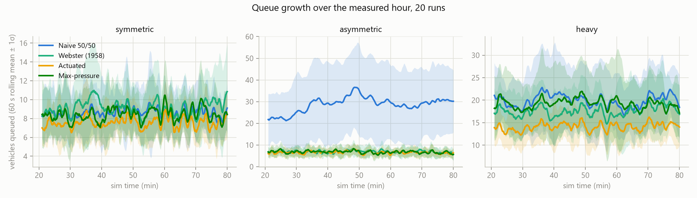

# traffic-rl

**Can smarter traffic-light timing cut how long we all wait?**

We have all sat at a red light on an empty road while the busy direction backs
up. This project tests whether better signal control actually fixes that —
starting with an honest simulator and the four classic strategies traffic
engineers already use, so anything built later (Phase 2: a reinforcement-learning
agent) has real opponents to beat. If the RL agent cannot beat the classics,
that gets published as a negative result, not a buried one.

## Phase 1 results

Headline metric: **p95 wait** — the unluckiest 1 in 20 drivers. Average wait
lies; it hides a light quietly leaving one road to rot. Every number below is
the mean of **20 independent seeded runs** with a t-based 95% CI, and every
controller sees the *same* 20 demand realizations (paired seeds).


| p95 wait (s) | symmetric | asymmetric | heavy |
|---|---|---|---|
| Naive 50/50 | 44.7 | **153.2** (CI 127–179, wildly unstable) | 78.0 |
| Webster (1958) | 50.0 | 62.1 | 65.6 |
| Actuated | **37.8** | **35.5** | **50.8** |
| Max-pressure | 42.5 | 36.9 | 68.8 |

On the asymmetric scenario (a busy road crossing a quiet one — the case that
motivated the project), demand-blind 50/50 timing leaves the unlucky driver
waiting **2.5 minutes and swings wildly run to run**, while a 1958 formula cuts
that 2.5x and the two adaptive controllers cut it **4.3x**. Paired per-seed
differences vs naive (the statistically honest comparison): Webster −91 s
[64, 118], actuated −118 s [92, 144], max-pressure −116 s [90, 142] — all
decisive.

Two honest wrinkles the charts surface rather than hide:

- **On symmetric demand, naive is fine.** A 50/50 split is the *right* answer
  when demand is symmetric; Webster lands in the same place. The naive
  controller's failure mode is specifically demand asymmetry.
- **Webster pays pedestrians for its vehicle gains.** The pedestrian service
  floor (20 s walk + clearance) forces Webster onto a long cycle on asymmetric
  demand, and its minor-road pedestrians wait for it (ped p95 85 s vs ~45–51 s
  for everyone else — see `docs/charts/ped_wait_bar.png`).



## Why trust these numbers

- **Per-run p95, aggregated across runs.** Waits within a run are autocorrelated,
  so a pooled percentile has no valid confidence interval. Each run contributes
  one p95; the 20 runs get a t-CI. The pooled distribution is only used for the
  (clearly labeled) ECDF chart.
- **Paired seeds (common random numbers).** Run *k* uses the same seed for every
  controller, and superiority claims cite the CI on the paired per-seed
  differences, not overlapping marginal bars.
- **Censoring is surfaced, not hidden.** Vehicles still queued at the horizon
  count with a lower-bound wait; if more than 5% of a run is censored its p95 is
  reported as "≥" and the run is flagged unstable. Dropping them would flatter
  exactly the worst controllers.
- **Identical rules for everyone.** One warm-up (1200 s), one measured hour, one
  signal-safety state machine (min green, yellow, all-red, ped locks, 120 s
  anti-starvation backstop) shared by all controllers.
- **Safety is enforced by the simulator, not trusted to controllers.** An
  adversarial controller that requests a random phase every second is part of
  the test suite; the state machine makes it safe by construction. The same
  guarantee will hold for the RL agent.
- **Fairness of baseline parameters.** Actuated uses textbook defaults (min
  green 8 s, max 45 s, 3.0 s gap). Max-pressure uses a 15 s control period,
  chosen from a documented sweep ({5, 10, 15, 20} s: heavy-scenario p95 falls
  83→62 s as the period grows while asymmetric stays ~36 s — max-pressure is
  blind to switching cost, and 5 s decisions thrash near saturation).

## The model (and its limits)

Single 4-way intersection, two phases (NS / EW), one lane group per approach,
no protected left turns. **Point-queue model**: Poisson arrivals per approach
(independent RNG streams), saturation-flow discharge (1800 veh/h/lane) with 2 s
startup lost time, no discharge during yellow/all-red. Pedestrians arrive
Poisson per crossing, place a call, and are served concurrently with the
parallel vehicle phase (7 s walk + 13 s clearance, never truncated).

Deliberate simplifications, stated up front: no car-following dynamics, no
spillback or link lengths (irrelevant with one intersection), no left turns,
1 s timestep. These change absolute waits but not controller *rankings*, which
is what Phase 1 is for. Max-pressure at a single isolated intersection honestly
degenerates to weighted longest-queue-first — it is included because it is the
standard classical baseline in the RL traffic literature.

The simulator runs **~40,000x real time** (a full sim-hour in well under a
second of wall clock; the entire 12-experiment, 240-run evaluation takes about
a minute).

## Quickstart

```powershell
pip install -e .[dev]          # numpy core + charts + viewer + tests
pytest                         # 35 tests incl. safety invariants + 800x perf gate
traffic-rl-eval --runs 20      # full 4-controller x 3-scenario evaluation
traffic-rl-charts              # renders results/charts/*.png
traffic-rl-watch --controller actuated --scenario asymmetric --speed 8
```

The viewer (`pygame-ce`) shows live queues, signal heads, and pedestrian walk
phases at 1x–1024x. Keys: `Space` pause · `+`/`-` speed · `R` new seed · `Esc`
quit.

## Phase 2: the RL interface is already here

The sim core *is* the environment: `reset(seed) -> Observation`,
`step(action) -> StepResult`. `Observation` is fixed-size numeric arrays (flattens
straight into a Gymnasium `Box`), `StepResult.info` carries per-step reward
ingredients (`wait_accrued_this_step`, `departures_this_step`, `total_queue`),
and `action_mask` exposes which phases are legal. A Gymnasium wrapper needs
zero changes to the core — and the signal state machine means a half-trained
policy still cannot run a yellow, truncate a walk phase, or starve an approach
past the backstop.

## Layout

```
src/traffic_rl/
├── sim/          # IntersectionSim, SignalStateMachine, queues, arrivals
├── controllers/  # naive 50/50, Webster, actuated, max-pressure (+ base API)
├── eval/         # metrics (the honesty rules), harness, charts
└── viewer/       # live pygame viewer
```

MIT license. Built as the Phase 1 floor for an open RL-for-traffic experiment.
